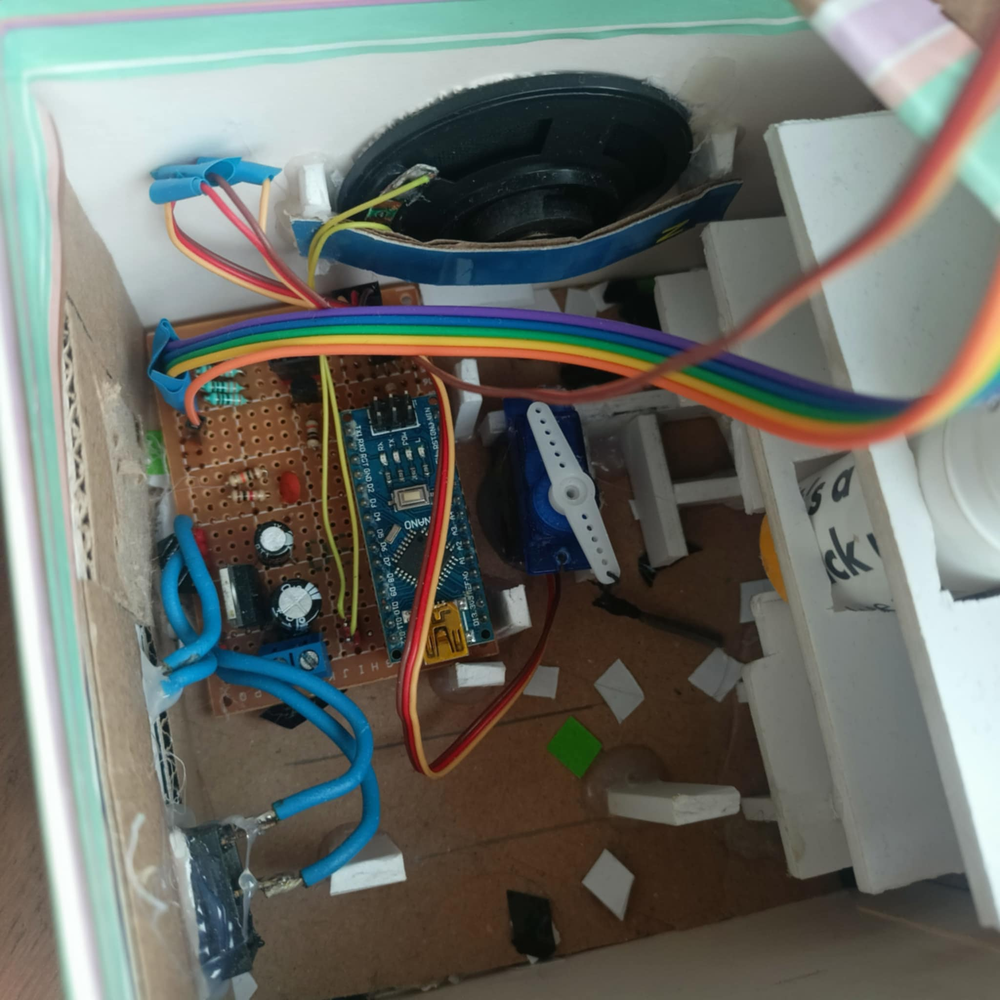

#  Arduino: Wybuchowy Prezent – Gorący Ziemniak 

## Opis projektu

Projekt zabawki **GORĄCY ZIEMNIAK**, zbudowanej na bazie Arduino Nano.  
Zasady: ustalasz czas odliczania do końca,urządzenie zaczyna odliczanie, w trakcie odliczania wysyłane są sygnały dźwiękowe oraz świetlne aż w kulminacyjnym momencie otworzy się pokrywka i wystrzeli konfetti

Świetna zabawa na spotkania ze znajomymi, rodzinne imprezy lub jako kreatywny projekt edukacyjny.

---

## Schemat działania projektu

### Start

- Włącz zasilanie urządzenia (przełącznik ON).
- Wstępna sekwencja: wszystkie 4 diody LED świecą ciągłym światłem.
- Czekamy na wciśnięcie przycisku.

### Wybór czasu gry

- Każde kliknięcie przycisku zwiększa czas gry o 1 minutę.
- Maksymalnie można ustawić **4 minuty**.
- Diody LED pokazują wybrany czas:
  - 1 kliknięcie = 1 dioda
  - 2 kliknięcia = 2 diody itd.
- Po 5 kliknięciu licznik resetuje się do 1 minuty.
- Jeśli przez 10 sekund nie naciśniesz przycisku, automatycznie zaczynamy grę.

### Odliczanie czasu

- LED-y zaczynają migać — im mniej czasu, tym szybciej migają.
- Buzzer sygnalizuje upływ czasu:
  - Co 5 sekund na początku
  - Co 3 sekundy w ostatnich 30 sekundach
  - Co 1 sekundę w ostatnich 10 sekundach
  - Co 0,5 sekundy w ostatnich 5 sekundach
  - Ostatnia sekunda: ciągły dźwięk alarmu

### Finałowe efekty

- 1 sekunda przed końcem: serwo 1 otwiera pokrywkę!
- Po upływie czasu:
  - Serwo 2 uruchamia wystrzał konfetti
  - Buzzer wydaje ciągły dźwięk.
  - LED-y migają intensywnie.
- Po zakończeniu zabawy oba serwa wracają do pozycji początkowej (0°).

### Reset

- Po zakończeniu urządzenie wraca do trybu oczekiwania na naciśnięcie przycisku i rozpoczęcie nowej gry.

---

## Użyte elementy

| Element                | Ilość | Pin Arduino |
|------------------------|-------|-------------|
| Arduino Nano           | 1     | -           |
| Czerwone diody LED     | 4     | D2–D5       |
| Przycisk               | 1     | D6          |
| Buzzer                 | 1     | D7          |
| Serwo SG90 (pokrywka)  | 1     | D8          |
| Serwo SG90 (konfetti)  | 1     | D9          |
| stabilizator 5V | 1 | - |
| Akumulator Li-Po 3.7V | 2 | - |
| Konfetti             | | - |

Konfetti wykonane z tuby po kleju oraz gumki rezepturki 

---
## link do video z działania
https://youtube.com/shorts/UREUckXR5QE?feature=share
---
## Galeria projektu

